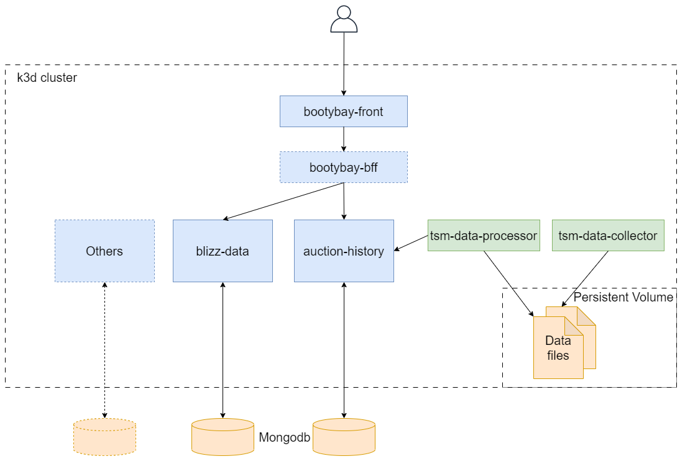

# Bootybay

## Introduction

This is a tool that helps me to do some analysis about the auction house in the World of Warcraft.  
The main features that I'm currently thinking is:

- A dashboard to display the real-time auction data of different realms.
- See the price evolution of an item on the auction house.
- Calculate profitable crafting items based on material prices.
- Compare item prices on different realms for realm transfer preparation.

The data sources will be from [TSM](https://www.tradeskillmaster.com/) or the [Blizzard's API](https://develop.battle.net/).

## Architecture

I also consider it a very good place to try out and practice new technologies. Thus, its architecture design is more of what I want to do than a real-life project. The choices that I made may not be the most appropriate ones.

This project is a monorepo generated using [Nx](https://nx.dev). It contains:

- a frontend project using **React** and **Material UI**
- several backend web services based on micro-service architecture, using **NestJS** and **Mongodb**
- some jobs (one-shot or scheculed) in **Node.js** to supply data.

All the modules are built into docker images and deployed into a k3d cluster.

